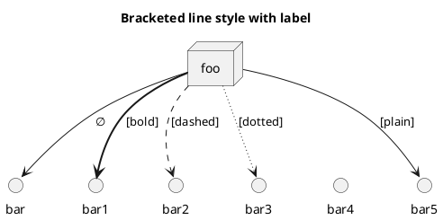

A diagram:

```plantuml format="svg"
@startuml

title Bracketed line style with label
node foo
foo --> bar          : ∅
foo -[bold]-> bar1   : [bold]
foo -[dashed]-> bar2 : [dashed]
foo -[dotted]-> bar3 : [dotted]
foo -[hidden]-> bar4 : [hidden]
foo -[plain]-> bar5  : [plain]
@enduml

```
